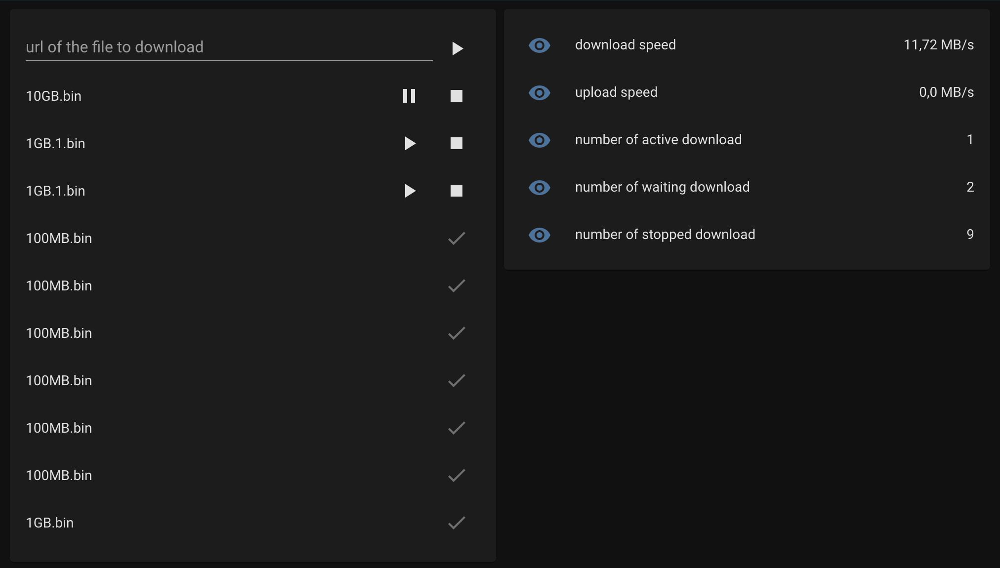

# Aria2 integration on home assistant

Aria2 integration for home assistant

Allow to:
   - have sensor on some aria2 stats
   - call a service to start to downlod
   - get the list of all downloads (to stop, pause and resume)

## Installation

You can use [HACS](https://hacs.xyz/) to install this component. Search for the Integration "aria2 integration".

If you want to install it manualy, copy the `custom_components/aria2` directory on your `custom_components` directory.

## Configuration

Add your device via the Integration menu.

## Service

You can call the service `aria2.start_download` with the `url` parameter to start to download the file

## Sensor

The following sensor are available:
   - download_speed: the current global download speed or your aria2 server
   - upload_speed: the current global upload speed or your aria2 server
   - number_of_active_download: the total number of active download
   - number_of_waiting_download: the total number of download waiting to start or resume
   - number_of_stopped_download: the total number of downloaded file

## Event

In case of download start/stop/pause/complete/error an event `download_state_updated` is sent.
The event data are:
  - `gid`: the gid of the download
  - `status`: the status of the event active/paused/stoped/complete/error
  - `download.name`: the name of the downloaded file
  - `download.total_length`: the total length of the file (bytes)
  - `download.completed_length`: the downloaded length of the file (bytes)
  - `download.download_speed`: the current download speed (bytes / s)

theses data can be used on automation using template `{{trigger.event.data}}` followed by data name (example: `{{trigger.event.data.download.name}}`)

## Lovelace card

To be able to display the download list you can use the [aria2-card](https://github.com/deblockt/aria2-card)

